# Attendance Monitoring Application for October 6 University to Pharmacy College with GPS

[](https://flutter.dev)
[](https://supabase.com)
[](LICENSE)
[](#)

> Cross‑platform attendance monitoring app for **October 6 University – Pharmacy College**. Secure, QR‑based check‑ins with GPS verification, role‑based portals (Admin, Trainee Supervisor, Student), and signed PDF reports with on‑device verification.

> The application wwas created and fully architectured by me, Abdelrahman Habeeb, to serve the Pharmacy College to monitor their training completion. I have NO knowledge of flutter or dart coding and fully assisted with Gemini Pro (Core Coding) and DeepSeek (UI), with no other than my human interaction or assistance. The project fully increased my IT skills as problem solver. This project have been done in only three to four weeks.
---

## Table of Contents

* [Project Overview](#project-overview)
* [User Roles](#user-roles)
* [Core Features](#core-features)

  * [Admin](#admin)
  * [Trainee Supervisor](#trainee-supervisor)
  * [Student](#student)
* [Architecture & Stack](#architecture--stack)
* [Database Schema](#database-schema)
* [Key Workflows](#key-workflows)

  * [Account Approval & Notification](#account-approval--notification)
  * [Attendance Scan (QR + GPS)](#attendance-scan-qr--gps)
  * [PDF Reports & Verification](#pdf-reports--verification)
* [Security & Privacy](#security--privacy)
* [Getting Started](#getting-started)

  * [Prerequisites](#prerequisites)
  * [Setup](#setup)
  * [Run](#run)
  * [Build](#build)
* [Configuration](#configuration)
* [Project Structure](#project-structure)
* [Screenshots](#screenshots)
* [Roadmap](#roadmap)
* [Contributing](#contributing)
* [License](#license)

---

## Project Overview

The **O6U Pharmacy Attendance System** modernizes practical‑training attendance using a secure, time‑limited **QR code** flow. Supervisors generate dynamic QR codes; students scan them to record attendance. GPS coordinates are captured to prevent misuse. Admins manage users, training rounds, and reporting.

The app provides separate portals and tailored workflows for **Admins**, **Trainee Supervisors**, and **Students**.

---

## User Roles

**Admin** – central authority for user/round management and global reporting.

**Trainee Supervisor** – on‑site personnel generating QR codes, monitoring attendance, and evaluating students.

**Student (Trainee)** – enrolls in rounds, scans supervisor QR codes to check in, views history, and generates verified reports.

---

## Core Features

### Admin

* **Dashboard** (`AdminHome.dart`) – access to all admin functions.
* **User Management** (`ApproveSignUps.dart`) – approve/reject student sign‑ups; approval activates the account.
* **Supervisor Management**

  * Create supervisors (`AdminCreateSupervisor.dart`) and assign training centers.
  * Manage supervisors (`AdminManageSupervisors.dart`): delete, toggle active/inactive, update assignments.
* **Round Management** (`AdminManageRounds.dart`)

  * Create/update/delete training rounds; define name, location, start/end dates, lead supervisor.
  * Set **excluded dates** (holidays/weekends) that don’t count toward expected attendance days.
* **Student Management** (`ManageStudentsScreen.dart`) – search/filter active students; **Force Redirect** students to a round.
* **Attendance Monitoring** – drill down by round/day (`RoundDaysScreen.dart → AttendanceStatusScreen.dart`).
* **Advanced Reporting & Evaluation** (`ShowEvaluation.dart` menu)

  * **Comprehensive Reports** for any student across rounds → PDF (`AllStudentsReportListScreen.dart`).
  * **Single‑Round Reports** → PDF (`FinalEvaluationScreenAdmin.dart`).
  * **Report Verification** – scan report QR to fetch original data (`AdminQRScannerScreen.dart`).
  * **Manual Evaluations** – view all supervisor comments (`ManuallyEvaluatedScreen.dart`).

### Trainee Supervisor

* **Dashboard** (`TraineeSupervisorHome.dart`).
* **QR Code Generation** (`GenerateQRCode.dart`) – dynamic QR valid \~5 minutes; encodes supervisor ID, training center ID, timestamp.
* **Attendance Monitoring** (`CheckAttendance.dart`) by day.
* **Rounds & Students** (`SupervisorViewRounds.dart`).
* **Student Evaluation** (`EvaluateStudentsScreen.dart`).
* **Reporting & Verification** – per‑student reports (`SupervisorStudentReportsScreen.dart`), verify PDFs by scanning (`SupervisorQRScannerScreen.dart`).

### Student

* **Dashboard** (`StudentHome.dart`) – disabled until admin approval.
* **Scan Attendance** (`ScanQRCode.dart`) – validates QR, verifies active round/supervisor match, captures GPS, prevents duplicates.
* **Round Enrollment** (`StudentSelectRound.dart`).
* **Attendance History** (`ViewAttendanceRecord.dart`) – Attended / Absent / Upcoming / Excluded.
* **Report Generation** (`FinalEvaluationScreen.dart`)

  * Single‑round detailed PDF (`AdvancedEvaluationScreen.dart`).
  * All‑rounds summary PDF (`AllRoundsReportScreen.dart`).
* **Notifications** (`NotificationListScreen.dart`) – e.g., Account Approved, Enrolled in Round.
* **Training Terms** (`TrainingTermsScreen.dart`) – open external docs.

---

## Architecture & Stack

* **Framework:** Flutter (cross‑platform mobile)
* **Backend:** Supabase (BaaS)
* **Database:** Supabase PostgreSQL
* **Auth:** Custom PostgreSQL function `authenticate_user` (returns role & status)
* **Key Packages:**

  * `supabase_flutter`, `mobile_scanner`, `qr_flutter`
  * `pdf`, `printing`, `flutter_local_notifications`
  * `shared_preferences`, `geolocator`, `geocoding`
  * `google_fonts`, `intl`, `workmanager`

---

## Database Schema

Mermaid ER diagram of core tables & relations:

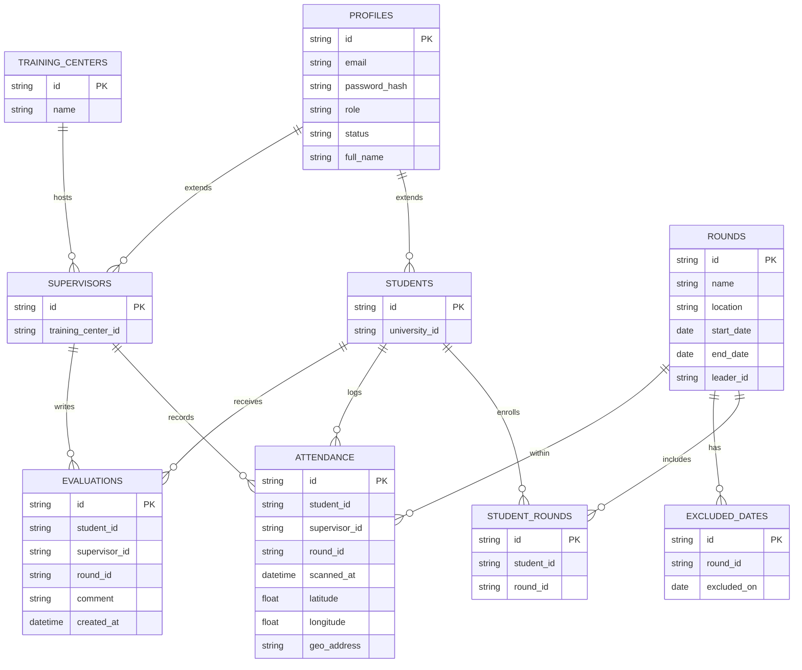

> **Auth**: `authenticate_user(email, password)` checks `profiles` and returns `{ id, role, status }`.

> **Auth**: `authenticate_user(email, password)` checks `profiles` and returns `{ id, role, status }`.

---

## Key Workflows

### Account Approval & Notification

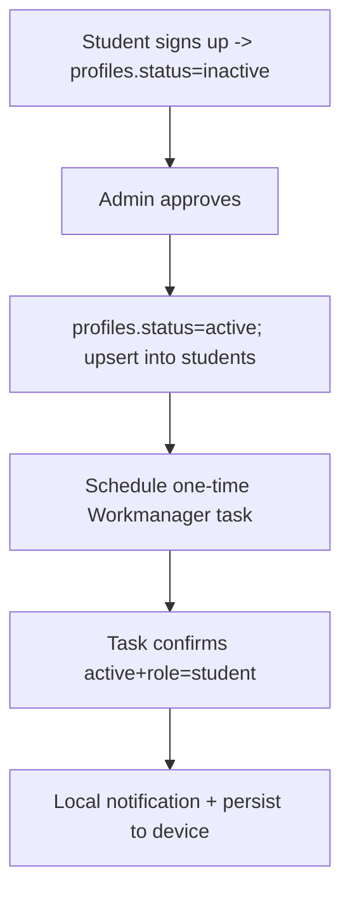

### Attendance Scan (QR + GPS)

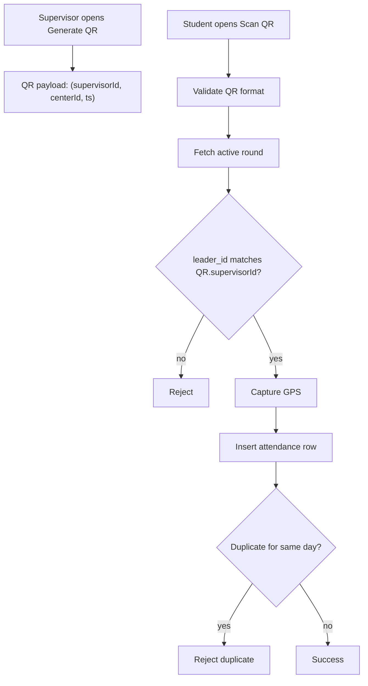

### PDF Reports & Verification

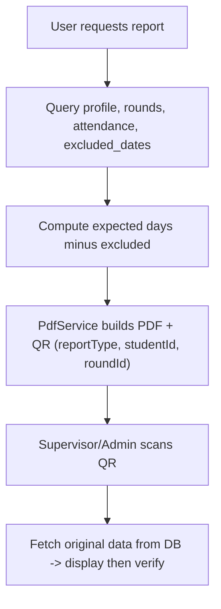

---

## Security & Privacy

* **Dynamic QR**: includes timestamp; validity ≈ **5 minutes** to reduce reuse.
* **Supervisor binding**: student’s active round must match `leader_id` from QR.
* **GPS capture**: coordinates recorded at scan time; consider reverse‑geocoding for readability.
* **Duplicate prevention**: unique constraint on `(student_id, round_id, date)`.
* **Signed PDFs**: each report embeds a verification QR with minimal identifiers; verification fetches authoritative data.
* **Data minimization**: store only what’s necessary (IDs, timestamps, coords).
* **Permissions**: camera + location prompts with clear rationale in‑app.

---

## Getting Started

### Prerequisites

* Flutter **3.x** (Dart **3.x**)
* A Supabase project (URL + anon key)
* Android/iOS tooling (Android Studio / Xcode)

### Setup

```bash
# 1) Clone
git clone https://github.com/<your-org>/O6U-PharmAttendance.git
cd O6U-PharmAttendance

# 2) Install deps
flutter pub get

# 3) Configure environment
cp .env.example .env
# edit .env with your Supabase credentials
```

**.env.example**

```env
SUPABASE_URL=https://YOUR-PROJECT.supabase.co
SUPABASE_ANON_KEY=YOUR_ANON_KEY
QR_VALID_MINUTES=5
```

Initialize Supabase in your app (e.g., early in `main()`):

```dart
await Supabase.initialize(
  url: dotenv.env['SUPABASE_URL']!,
  anonKey: dotenv.env['SUPABASE_ANON_KEY']!,
);
```

> You can pass values via `--dart-define-from-file=.env` or load with a package like `flutter_dotenv`.

### Run

```bash
flutter run --dart-define-from-file=.env
```

### Build

```bash
# Android
flutter build apk --release --dart-define-from-file=.env
# iOS (requires macOS/Xcode)
flutter build ios --release --dart-define-from-file=.env
```

---

## Configuration

Key flags and constants:

* `QR_VALID_MINUTES` – rolling validity window for supervisor QR codes.
* Location accuracy & timeout for `geolocator`.
* PDF fonts/branding for `pdf` + `printing`.
* Notification channel IDs for `flutter_local_notifications`.

---

## Project Structure

```
lib/
  core/
    services/
      pdf/
        pdf_service.dart
      supabase_client.dart
    utils/
      date_utils.dart
      location_utils.dart
  features/
    admin/
      AdminHome.dart
      ApproveSignUps.dart
      AdminCreateSupervisor.dart
      AdminManageSupervisors.dart
      AdminManageRounds.dart
      RoundDaysScreen.dart
      AttendanceStatusScreen.dart
      FinalEvaluationScreenAdmin.dart
      AdminQRScannerScreen.dart
      ManuallyEvaluatedScreen.dart
      AllStudentsReportListScreen.dart
    supervisor/
      TraineeSupervisorHome.dart
      GenerateQRCode.dart
      CheckAttendance.dart
      SupervisorViewRounds.dart
      EvaluateStudentsScreen.dart
      SupervisorStudentReportsScreen.dart
      SupervisorQRScannerScreen.dart
    student/
      StudentHome.dart
      ScanQRCode.dart
      StudentSelectRound.dart
      ViewAttendanceRecord.dart
      FinalEvaluationScreen.dart
      AdvancedEvaluationScreen.dart
      AllRoundsReportScreen.dart
      NotificationListScreen.dart
      TrainingTermsScreen.dart
```

---

## Screenshots

<p>
  
 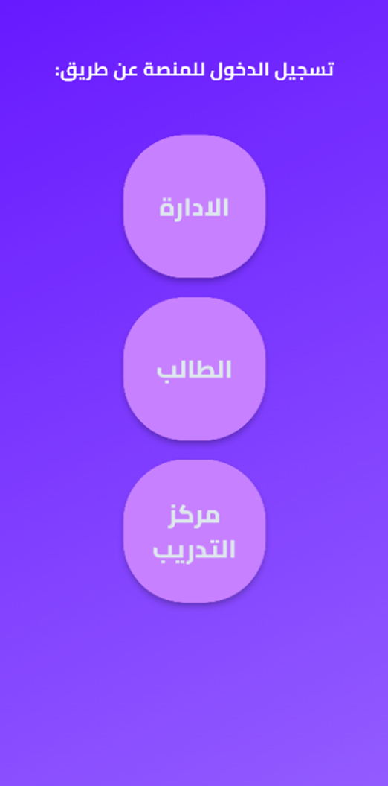
 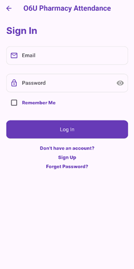
 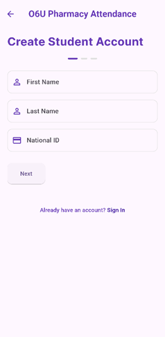
 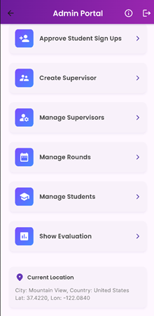
 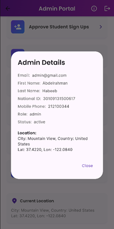
 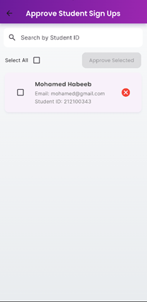
 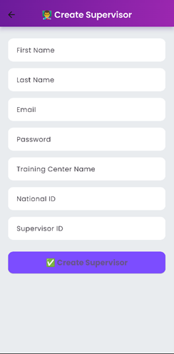
 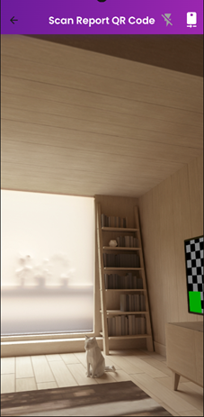
</p>


```

```

---

## Roadmap

* Offline scan & later sync
* Geofencing for approved training center per round
* Supervisor handover within an active round
* In‑app report sharing (secure link)
* Audit trails & export tooling

---

## Contributing

1. Fork the repo
2. Create a feature branch: `git checkout -b feat/my-change`
3. Commit with Conventional Commits: `git commit -m "feat: add X"`
4. Push: `git push origin feat/my-change`
5. Open a Pull Request

---

## License

This project is licensed under the **MIT License**. See `LICENSE` for details.

---

### Appendix: QR Payload & Example

**Supervisor QR payload** (encoded as text/JSON or compact string):

```json
{
  "sid": "<supervisor_uuid>",
  "cid": "<training_center_uuid>",
  "ts": 1717411200
}
```

**Report QR payload**:

```json
{
  "t": "single|all",
  "studentId": "<uuid>",
  "roundId": "<uuid|null>"
}
```

> Keep QR payloads minimal; verification always resolves ground‑truth from DB.
